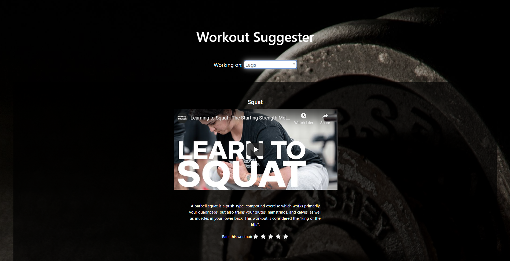

# Workout Suggester API


Link to live app: https://workout-suggester-ten-gilt.now.sh/



An application that suggest workouts based off of bodyparts. 

### Back-End
* PostgreSQL
* Express
* Node
* Knex

### Testing
* Mocha
* Chai
* Chai-http
* Jest

## API Overview

```text
/api
.
├──── GET
        ├── /workout
                ├── /workout/chest
                ├── /workout/legs
                ├── /workout/shoulders
                ├── /workout/back
                ├── /workout/arms
                ├── /workout/cardio
                ├── /workout/stretches-warmup
